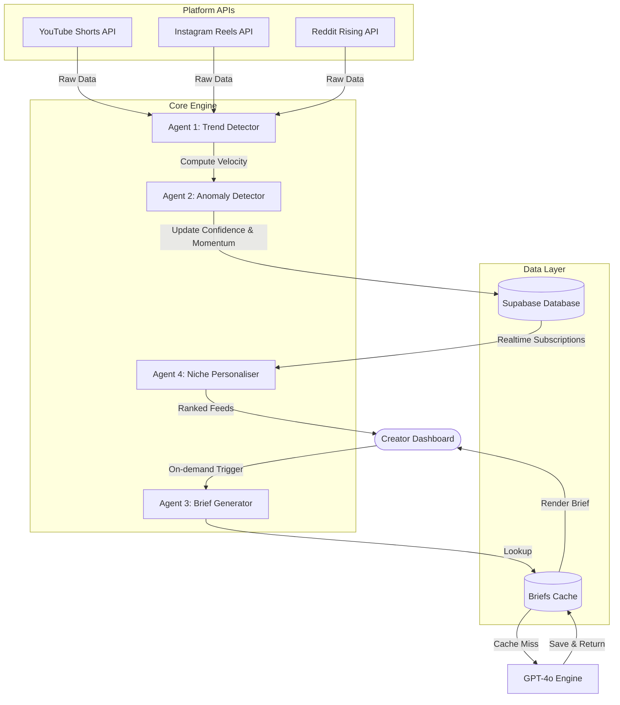

# 🕵️‍♂️ ViralSpy

[](https://viral-spy-eight.vercel.app)

[](https://nextjs.org/)
[](https://tailwindcss.com/)
[](https://supabase.com/)
[](https://deepmind.google/)
[](https://opensource.org/licenses/MIT)

> 🌐 **Live Demo:** [https://viral-spy-eight.vercel.app](https://viral-spy-eight.vercel.app)

> **Velocity over Vanity.**
> Total view counts are a trailing metric. ViralSpy tracks velocity to capture breakout topics before the algorithm reaches saturation.

ViralSpy is a full-stack trend prediction SaaS built for content creators. By monitoring YouTube Shorts, Instagram Reels, and Reddit trends, ViralSpy identifies breakout topics 48 hours before they hit peak algorithmic saturation and generates immediate, production-ready video strategy briefs.

---

## 📖 The Manifesto & Design Identity

This application is built using the **SpecKit Design System**—a minimalist, cinematic magazine-style interface designed for dark guest terminals.

- **Background:** Strict Deep Charcoal-Black (`#1A1A1A`)
- **Text & Accents:** Warm Print-Style Off-White (`#F4F2ED`)
- **Borders & Rules:** Sharp edges, `1px solid rgba(244, 242, 237, 0.1)`. No rounded corners (`rounded-none` globally), no neon gradients.
- **Pulsing Breakouts:** Breakout trends (`EXPLODING` state) feature a custom red pulsing shadow border.

---

## ✨ Key Features

- **Multi-Platform Trend Tracking:** Real-time ingestion of rising trends from YouTube Shorts, Instagram Reels, and Reddit.
- **Velocity Scoring:** Real-time velocity delta computation using post-per-hour changes and historical rolling averages.
- **Statistical Anomaly Detection:** Real-time Z-score statistical modeling to flag early breakouts.
- **AI Strategy Dossier Generator:** Instantly converts any trending topic into ready-to-use hooks, creative angles, and script outlines.
- **Guest Demo Mode:** 100% functional local sandbox utilizing mock data and `localStorage` fallback wrappers when external database credentials are not present.

---

## 🤖 The AI Agents System

ViralSpy runs on a collaborative multi-agent architecture designed to process, evaluate, and action emerging web trends:



1. **Agent 1 — Trend Detector** (Scheduled/Manual Poll): Polls YouTube Shorts, Instagram Reels, and Reddit across 15 niches. It computes velocity as:
   $$\text{Velocity} = \left(\frac{\text{posts per hour}}{\text{average posts (24h)}}\right) \times 100$$
2. **Agent 2 — Anomaly Detector** (Inline Analyzer): Runs statistical Z-score analysis ($Z > 2.5$) against a 7-day rolling average to flag early breakouts and promote them.
3. **Agent 3 — Brief Generator** (On-Demand Strategy): Uses GPT-4o / Gemini models to construct creator briefs with a custom prompt, outputting JSON including hooks, angles, hashtags, best posting times, and script outlines.
4. **Agent 4 — Niche Personaliser** (Client-Side Ranker): Ranks and weights content trends according to user-profile preferences and momentum states.

---

## ⚙️ Setup & Execution

### Prerequisites

- **Node.js**: `v18.x` or higher
- **npm**: `v9.x` or higher
- **Supabase Account** (Optional, runs in local sandbox Guest Mode by default)

### 1. Clone & Configure Environment

```bash
git clone https://github.com/your-username/ViralSpy.git
cd ViralSpy
```

Create a `.env.local` file in the root directory:

```env
NEXT_PUBLIC_SUPABASE_URL=your-supabase-project-url
NEXT_PUBLIC_SUPABASE_ANON_KEY=your-supabase-anon-key
GEMINI_API_KEY=your-gemini-api-key
GROQ_API_KEY=your-groq-api-key
```

_Note: If credentials are left blank, ViralSpy automatically launches in **Guest Demo Mode** utilizing local mock storage._

### 2. Install Dependencies

```bash
npm install
```

### 3. Database Initialization

If using a live Supabase project, execute the SQL schema in [supabase_schema.sql](file:///d:/ViralSpy/supabase_schema.sql) using your Supabase SQL Editor.

### 4. Running Locally

Start the Next.js development server:

```bash
npm run dev
```

Open [http://localhost:3000](http://localhost:3000) to view the application.

### 5. Seeding Data

To seed the local storage or Supabase database with mock trend records:

- Click **"RE-SEED DEMO"** directly inside the Dashboard header, or
- Send a `POST` request to `/api/seed` to load the initial 20 trend profiles.

---

## 🧪 Testing & Validation

Run the validation, testing, and formatting suites to verify code health:

```bash
# Run unit & smoke tests
npm run test

# Check lint rules
npm run lint

# Check formatting
npm run format:check

# Run full project health check
npm run check:all
```

---

## 🗺️ Roadmap

- [ ] **Extended Platform Scrapers:** Support TikTok velocity metrics and Pinterest trends.
- [ ] **Creator Workspace Sync:** Push briefs directly to Notion, Trello, or Slack.
- [ ] **Advanced Z-Score Filters:** Let creators customize anomaly alert thresholds.
- [ ] **Automated Script Voice Generation:** Generate draft voiceovers matching the brief hook.

---

## 📄 License

Distributed under the MIT License. See [LICENSE](LICENSE) for more information.

---

💼 _ViralSpy — Cinematic Trend Intelligence for Creators._
