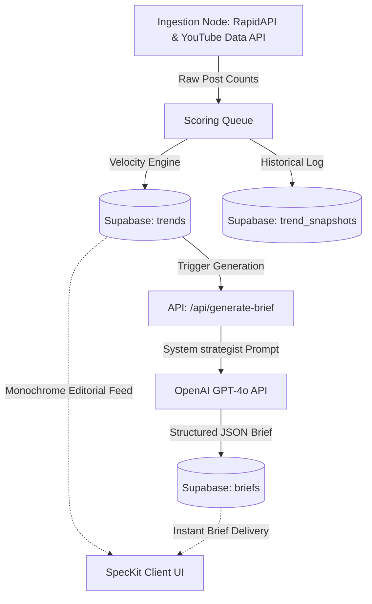

# SPECIFICATION KIT // VIRALSPY
### THE COLD PRINT BLUEPRINT FOR PREDICTIVE VIRALITY
*Document Ref: SPK-2026-V1 // Status: Production Ready*

---

## I. EXECUTIVE SUMMARY

### The 48-Hour Inversion
In the modern economy of attention, content creators do not fail due to a lack of effort; they fail due to **temporal lag**. By the time a TikTok, YouTube, or Instagram trend reaches the user's organic feed, it has already crested, saturated the algorithmic distribution channels, and entered its terminal decay phase. Filming content for a peaked trend results in near-zero organic reach, representing wasted production capital.

**ViralSpy** inverts this dynamic. By monitoring early posts-per-hour velocity signals, the engine detects and classifies viral trends **48 hours before they reach peak feed saturation**. 

```
                       VIRAL SATURATION CURVE
          
      Reach
        ▲
        │                                * * * (Saturated Feed Peak)
        │                             *         *
        │                           *             *
        │               (VIRALSPY)*                 * (Decay/Peaked)
        │                       *                     *
        │                     *                         *
        │         * * * * * *                             *
        └────────────────────────────────────────────────────────► Time
                  ◄────────────►
                  The 48-Hour Advantage
```

Rather than building complex, heavy videography setups in reaction to yesterday's news, creators receive **ready-to-film content briefs** (hooks, angles, and formats) mapped to rising topics during their high-velocity growth phase.

---

## II. TECHNICAL ARCHITECTURE

ViralSpy is structured as a light, high-throughput pipeline designed for low-latency scoring and content brief generation.

### System Topology Flow



### Stack Blueprint

1. **Frontend / Application Shell**: Next.js 14 App Router. Restricts all interface state to server-rendered shell architectures, utilizing client-side hydration only where user filter states or clipboard events occur.
2. **Database & Storage Layer**: Supabase (PostgreSQL). Stores active trends, historical snapshots, user niches, and briefs. Utilizes Row Level Security (RLS) to permit public read access of macro trend data while securing user niche cohorts.
3. **AI Strategy Engine**: OpenAI API (GPT-4o model). Bound to JSON response structures, feeding off a strict strategist system prompt to map creative video layouts directly from computed trend titles.

---

## III. DATABASE SCHEMA

The data layer is normalized across three primary tables, facilitating hourly updates and low-latency lookups.

### 1. `trends`
Stores the calculated status and identity of detected trends.

| Column Name | Data Type | Key / Constraint | Description |
| :--- | :--- | :--- | :--- |
| `id` | `UUID` | Primary Key, `default gen_random_uuid()` | Unique identifier of the trend. |
| `name` | `TEXT` | `NOT NULL` | The viral topic phrase, keyword, or challenge name. |
| `niche` | `TEXT` | `NOT NULL` | Niche categorisation (e.g., `fitness`, `food`, `tech`). |
| `platform` | `TEXT` | `NOT NULL` | Origin platform (e.g., `tiktok`, `youtube`, `instagram`). |
| `post_count` | `INTEGER` | `NOT NULL` | Total scanned posts matching the topic. |
| `velocity_score`| `NUMERIC` | `NOT NULL` | Calculated growth rating as a percentage. |
| `momentum_status`|`TEXT` | `CHECK (in ('EXPLODING', 'RISING', 'PEAKED'))`| Trend classification tier. |
| `detected_at` | `TIMESTAMPTZ` | `DEFAULT now()` | Timestamp of first database entry. |
| `raw_data` | `JSONB` | Optional | Contains raw array of recent points for sparkline generation. |

### 2. `trend_snapshots`
Records hourly historical post counts to fuel the scoring model and sparkline visualization.

| Column Name | Data Type | Key / Constraint | Description |
| :--- | :--- | :--- | :--- |
| `id` | `UUID` | Primary Key, `default gen_random_uuid()` | Unique snapshot record ID. |
| `trend_id` | `UUID` | Foreign Key `references trends(id)` | Linked trend. |
| `posts_count` | `INTEGER` | `NOT NULL` | Checked post count at the snapshot moment. |
| `timestamp` | `TIMESTAMPTZ` | `DEFAULT now()` | Time of recording. |

### 3. `briefs`
Saves the AI-generated ready-to-film specifications.

| Column Name | Data Type | Key / Constraint | Description |
| :--- | :--- | :--- | :--- |
| `id` | `UUID` | Primary Key, `default gen_random_uuid()` | Unique brief identifier. |
| `trend_id` | `UUID` | Foreign Key `references trends(id)` | Associated trend record. |
| `hook` | `TEXT` | `NOT NULL` | Killer hook formula under 8 words. |
| `angles` | `JSONB` | `NOT NULL` | Structured array containing 3 unique video angles. |
| `format` | `TEXT` | `NOT NULL` | Video format recommendation (talking head, POV, duet). |
| `hashtags` | `JSONB` | `NOT NULL` | Array of 5 recommended tags. |
| `created_at` | `TIMESTAMPTZ` | `DEFAULT now()` | Brief generation timestamp. |

---

## IV. UI/UX DESIGN SYSTEM (SPECKIT)

The SpecKit design language shifts away from standard, neon SaaS interfaces toward a **minimalist, cinematic print-magazine aesthetic**. It values clean margins, sharp borders, high-contrast typography, and strict color values.

### Core Color Palette

```
  ┌───────────────────────────┐     ┌───────────────────────────┐
  │                           │     │                           │
  │          #1A1A1A          │     │          #F4F2ED          │
  │                           │     │                           │
  │   Primary Dark Background │     │   Text & Accent Off-White │
  └───────────────────────────┘     └───────────────────────────┘
```

* **Main Background**: `#1A1A1A` (Strict Slate Black)
* **Text / Primary Accents**: `#F4F2ED` (Warm Soft Off-white)
* **Borders / Separators**: `rgba(244, 242, 237, 0.1)` (Fine, low-opacity white line)

### Component Specifications

#### 1. Card Component
* **Aesthetic**: Rectilinear, sharp corners (no rounded margins). Looks like a physical block printed in a design journal.
* **Layout**: Thin outer border (`1px solid #F4F2ED/10`).
* **Hover Interaction**: Card border transitions to `#F4F2ED/25` with a subtle elevation transition.
* **Exploding Card**: Replaces border transition with an animated red pulse (`exploding-card-pulse`) that cycles the border opacity from `20%` to `70%` and casts a subtle `rgba(239, 68, 68, 0.2)` shadow glow.

#### 2. Badge Component
* **Aesthetic**: Monospaced text inside a thin border. Minimal padding (`px-2.5 py-0.5`).
* **States**:
  * **EXPLODING**: Red text and red border (`#ef4444`). Pulsing animation.
  * **RISING**: Off-white text and off-white border (`#F4F2ED`).
  * **PEAKED**: Muted transparent off-white text and border (`#F4F2ED/40`).

#### 3. Skeleton Loader
* **Aesthetic**: Solid blocks matching the `#1A1A1A` background, using a low-opacity off-white background overlay (`bg-[#F4F2ED]/5`).
* **Animation**: Flat opacity cycle (pulse) with no sliding shine or gradients.

---

## V. CORE ALGORITHMS

### Velocity Scoring Formulation
To identify trends before they reach mass feed saturation, the scoring system measures **relative velocity** rather than cumulative volume. This isolates small, early signals that are scaling rapidly.

$$\text{Velocity Score} = \left( \frac{\text{Current Posts per Hour}}{\text{Average Posts per Hour in Last 24 Hours}} \right) \times 100$$

### Classification Thresholds

* **Score > 300 // `EXPLODING`**: Current hourly posting activity exceeds the 24-hour average by more than 3x. Indicates an exponential breakout. Highlighted with the pulsing red SpecKit badge.
* **Score 150 - 300 // `RISING`**: Current activity is 1.5x to 3x the 24-hour average. Indicates active, healthy growth.
* **Score < 150 // `PEAKED`**: Activity has settled near or below the average. Indicates the trend has fully saturated the algorithm and is decaying.

---

— ViralSpy
